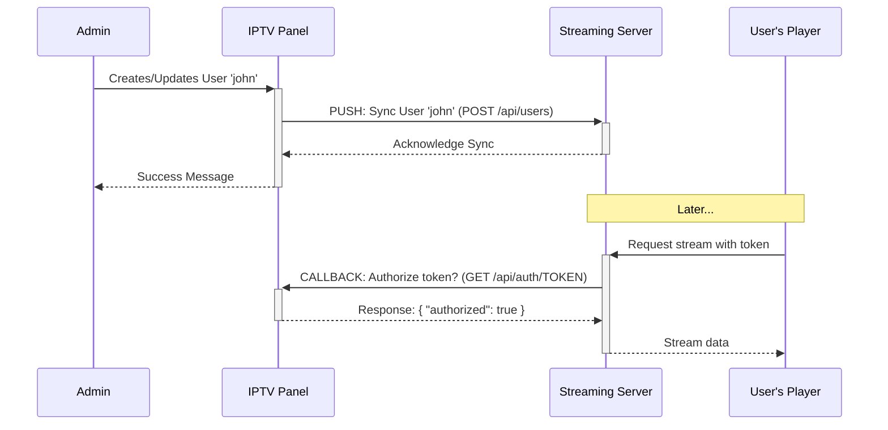

# IPTV Panel: Streaming Server Setup Guide

This document outlines the architecture and technical requirements for setting up a streaming server that is compatible with the IPTV Panel.

## 1. Architecture Overview

The interaction between the IPTV Panel and the Streaming Server follows a two-part design:

1.  **Panel-to-Server Push (Sync):** When an admin creates, updates, or deletes a user or channel in the panel, the panel sends this information to the streaming server via a REST API. This keeps the streaming server's user and channel database synchronized with the panel.
2.  **Server-to-Panel Callback (Auth):** When a user tries to watch a stream, the streaming server receives the request. Before granting access, it makes a real-time API call back to the panel to verify if the user's token is valid, active, and within connection limits.



---

## 2. Configuring the Panel to Connect to Your Streaming Server

For the panel to push updates to your streaming server, you must tell it where the server is and how to authenticate. This is done by setting the **Streaming API URL** and **API Token**.

You can configure this in two ways:

### Method 1: Using the Panel UI (Recommended)

1.  Log in to the IPTV Panel as an admin.
2.  Navigate to **Settings** from the main menu.
3.  Find the section for **Streaming Server Settings**.
4.  Enter the following values:
    *   **Streaming API Base URL:** The full URL to the root of your streaming server's API. For example: `http://192.168.1.10:8000` or `https://api.yourstreamingserver.com`.
    *   **Streaming API Token:** The secret password (bearer token) that your streaming server requires for authentication.
5.  Click **Save Settings**.

### Method 2: Using the .env File

For advanced users or automated deployments, you can set these values in the `.env` file located in the application's installation directory (`/opt/iptvpanel/.env`).

```ini
# ... other settings

# Streaming Service API
STREAMING_API_BASE_URL=http://192.168.1.10:8000
STREAMING_API_TOKEN=YourSecretTokenHere
```

After saving the `.env` file, you must restart the application for the changes to take effect:

```bash
sudo supervisorctl restart iptv-panel
```

### What These Settings Do

-   `STREAMING_API_BASE_URL`: This tells the panel the **IP address or domain** where it can reach your streaming server's API.
-   `STREAMING_API_TOKEN`: This is the secret key the panel sends with every API request to prove it's a legitimate source. Your streaming server must be configured to require this exact token.

---

## 3. Streaming Server API Requirements

Your streaming server **must** implement the following REST API endpoints to receive updates from the panel.

**Authentication:**
All requests from the panel will include an `Authorization` header. Your server must validate this token.

-   **Header:** `Authorization: Bearer <STREAMING_API_TOKEN>`

### User Endpoints

The base path for these endpoints is `/api/users` (this is configurable in the panel's `.env` file).

#### **`POST /api/users`** (Create User)

-   **Method:** `POST`
-   **Description:** Adds a new user to the streaming server.
-   **Request Body:**
    ```json
    {
      "username": "john123",
      "password": "user_password",
      "token": "a_very_long_and_unique_token_string",
      "email": "john@example.com",
      "max_connections": 2,
      "is_active": true,
      "expires_at": "2026-11-08T12:00:00"
    }
    ```

#### **`PUT /api/users/{username}`** (Update User)

-   **Method:** `PUT`
-   **Description:** Updates an existing user's details.
-   **Request Body:** Same as the `POST` request.

#### **`DELETE /api/users/{username}`** (Delete User)

-   **Method:** `DELETE`
-   **Description:** Removes a user from the streaming server.

### Channel Endpoints

The base path for these endpoints is `/api/channels`.

#### **`POST /api/channels`** (Create Channel)

-   **Method:** `POST`
-   **Description:** Adds a new channel to the streaming server.
-   **Request Body:**
    ```json
    {
      "channel_id": "hbo_hd",
      "name": "HBO HD",
      "category": "Movies",
      "source_url": "rtmp://source.stream/live/hbo",
      "logo_url": "http://path.to/logo.png",
      "is_active": true,
      "quality": "high"
    }
    ```

#### **`PUT /api/channels/{channel_id}`** (Update Channel)

-   **Method:** `PUT`
-   **Description:** Updates an existing channel's details.
-   **Request Body:** Same as the `POST` request.

#### **`DELETE /api/channels/{channel_id}`** (Delete Channel)

-   **Method:** `DELETE`
-   **Description:** Removes a channel from the streaming server.

---

## 4. Authentication Callback (Auth Request)

This is the most critical part of the integration. Your streaming server must be configured to check with the panel before allowing any user to access a stream.

-   **Endpoint to Call:** `https://<your_panel_domain>/api/auth/{token}`
-   **Method:** `GET`

### Auth Workflow

1.  A user's player requests a stream URL, like `http://<stream_domain>/live/hbo_hd/index.m3u8?token=USER_TOKEN`.
2.  Your streaming server extracts the `USER_TOKEN` from the request.
3.  Your streaming server makes a `GET` request to `https://<your_panel_domain>/api/auth/USER_TOKEN`.
4.  The panel responds with a JSON object. Your server must inspect the `authorized` field.

#### **Success Response (`200 OK`)**

If the user is valid, active, and within their connection limit, the panel returns:

```json
{
  "authorized": true,
  "username": "john123",
  "expiry": "2026-11-08T12:00:00",
  "max_connections": 2
}
```

**Action:** Your server should allow the request and serve the stream.

#### **Failure Response (`401`, `403`, `429`)**

If the user is invalid for any reason (bad token, expired, disabled, too many connections), the panel returns:

```json
{
  "authorized": false,
  "error": "Reason for failure (e.g., Connection limit reached)"
}
```

**Action:** Your server must **deny** the request with an appropriate HTTP status code (e.g., `403 Forbidden`).

---

## 5. Example Implementation: Nginx with `auth_request`

If you are using an Nginx-based streaming server (e.g., with the RTMP module), you can implement the auth callback efficiently using the `auth_request` directive.

This example assumes your streams are served from the `/live` location.

```nginx
# In your nginx.conf, inside the http block

# This location is an internal endpoint that performs the auth check.
# Nginx will send a sub-request here for every incoming stream request.
location /auth {
    internal; # Can only be reached by other nginx locations

    # The panel's auth endpoint
    proxy_pass https://<your_panel_domain>/api/auth/$arg_token;

    # Standard proxy settings
    proxy_pass_request_body off;
    proxy_set_header Content-Length "";
    proxy_set_header X-Original-URI $request_uri;
}


# In your server block for the streaming server

server {
    listen 80;
    server_name <stream_domain>;

    location /live {
        # 1. This directive triggers the auth check.
        #    It sends a sub-request to /auth.
        auth_request /auth;

        # 2. If the /auth sub-request returns 2xx, access is granted.
        #    If it returns 4xx, access is denied with a 403 Forbidden error.

        # 3. If access is granted, proceed to serve the stream
        #    (e.g., using the RTMP module, proxying to another backend, etc.)
        #
        # Example: proxy to a media server
        proxy_pass http://media_server_backend;
    }
}
```

This setup effectively offloads the entire authentication logic to the IPTV Panel, allowing your streaming server to focus solely on delivering video content.
